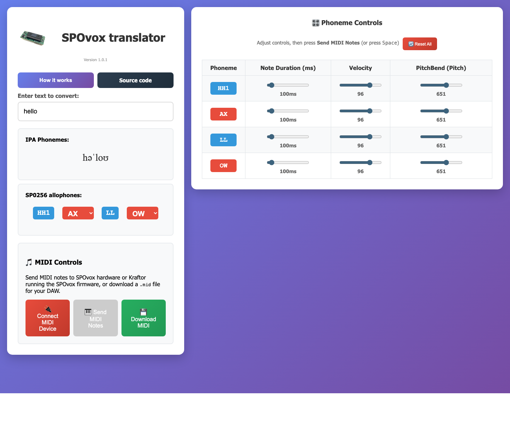

# SPOvox translator

**Version 1.0.1** — A browser-based tool for **SPOvox hardware** and **Kraftor running the SPOvox firmware**. It converts English text into approximate IPA, maps IPA to **SP0256-AL2** allophone tokens, and sends the sequence over **Web MIDI** or exports a single-track **Standard MIDI File**.

Run it here: https://deladriere.github.io/Spo_vox_translator/

## What It Does

- Converts typed text to an approximate IPA transcription.
- Maps IPA symbols to SP0256-AL2 allophones used by the SPOvox firmware (MIDI notes per token).
- Shows consonants as blue badges and vowels as red dropdowns (quick vowel swapping).
- **Per-phoneme controls:**
  - **Note Duration (ms)** — per-phoneme note duration in milliseconds.
  - **Velocity** — Note On velocity (default 96).
  - **PitchBend (Pitch)** — UI range **0–1023** (default 651), matching the LTC6903 master clock control value reached through MIDI pitch bend.
- **Send MIDI Notes** — Web MIDI (Chrome/Edge). Message order per phoneme: **pitch bend → Note On**.
- **Download MIDI** saves **`SPOvox.mid`** (120 BPM in the file); same parameters as the UI, using Note On trigger timing without extra stop events after the last phoneme.

## SPOvox Firmware Controls

This device path uses only the controls the SPOvox firmware actually consumes at phoneme start on SPOvox hardware or Kraftor.

| Cmd | Name | Range (default) | Meaning |
|-----|------|-----------------|--------|
| **20** | Volume | 0–127 (96) | Master volume. **MIDI:** Note On velocity per phoneme. |
| **22** | Pitch | Master clock 0–1023 in UI (651) | The firmware maps MIDI pitch bend `-8192..+8191` to the LTC6903 master clock control range `1023..0`. The app exposes that control value directly and converts it to 14-bit pitch bend on send/export. |

## Project Structure

- `index.html` — single-file app (UI, mapping tables, MIDI logic, controls).
- `Nexus_vox_designer.html`, `speakjet.h` — related assets / reference.

## How To Run

1. Open https://deladriere.github.io/Spo_vox_translator/ in a browser with Web MIDI (Chrome/Edge recommended), or open `index.html` locally.
2. **Connect MIDI Device** → pick output → **Connect**.
3. Type text; adjust per-phoneme controls as needed.
4. **Send MIDI Notes** (device required) or **Download MIDI** (no device), or press **Space** when the text field is not focused.

## Keyboard

- **Space** — send the MIDI sequence (only when the text input is **not** focused).

## Implementation Notes

- Conversion: `textToIPA(...)` then mapping via **`ipaToSp0256`**.
- Words are concatenated **without** an inter-word silence phoneme. **`PA0`** was for **Robovox** (word gaps); this SPOvox pipeline does not insert it.
- Live timing uses the configured **Note Duration (ms)** value for each phoneme.
- The SPOvox firmware path intentionally does not emit extra CC modulation such as CC1/CC5/CC7. Velocity already handles onset level and continuous volume control after speech starts is not useful for this device.
- Pitch display is expressed as the raw LTC6903 master clock control value so the UI matches `handlePitchBend(...)` in the firmware while still making it clear that MIDI pitch is driven by pitch bend.
